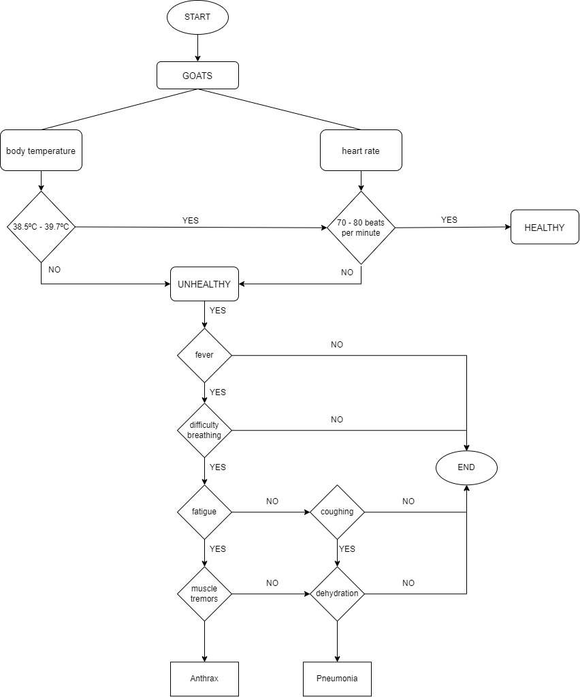

# Techno_Goat
Machine Learning to monitor goat health status based on its body temperature and heartbeat.

## Overview of Intellifarm Project
The 'Intellifarm Goat' project presents an innovative solution to revolutionize livestock management 
within the goat farming industry. Facing the challenges of manual health monitoring, our project 
introduces a comprehensive system employing advanced technology and data analytics. The core 
objective is to empower goat breeders and farmers with real-time health insights and predictive 
analysis, enabling proactive measures to enhance livestock welfare and prevent disease outbreaks.
This initiative integrates a user-friendly dashboard for seamless data visualization and an intelligence 
dashboard utilizing machine learning techniques for predictive modeling. The project not only caters 
to the immediate needs of goat farmers but also targets governmental and agricultural agencies, 
fostering collaborative research efforts in disease prevention and livestock health improvement.

## Flowchart for goat health monitoring

